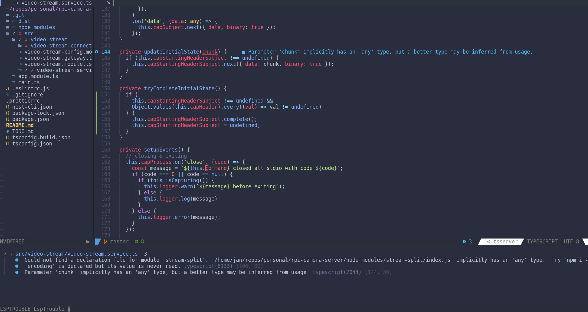

# Short Intro



This is my NeoVim config (for version 0.7.2 and greater).

## Features

Here's a short list of features that this config offers (through the use of 3rd party plugins).

* Autocompletion 
* Highlighting 
* Navigation
    * Find definition/declaration/implementation...
    * Find all references (of variables, methods, classes...)
    * Jump cursor focus forward/backward in time
    * Project tree view (NvimTree)
    * Switch between tabs
* Searching
    * Search by file name
    * Search by file contents
    * Search through NeoVim's help
* Refactoring (code actions)
    * Rename (variable, method, class...)
    * Automatically import
    * Simplify code
    * Infer type info
* Diagnostics
    * Show errors/warnings/hints/info
    * Diagnostic panel
    * Integration with status line
* Git
    * Highlight edited lines in number column
    * Navigate between hunks (changes)
    * Stage/unstage hunks
    * Preview old code
    * Status line integration
* Misc
    * Special start page
    * Indent guide lines
    * Motions for surrounding characters (brackets, parentheses...)
    * Easy commenting out code
    * Pretty status line
    * Default colorscheme
    * Enabled mouse integration
    * Keymappings for 10 finger typing on Slovene keyboard 

## Installation

I will make the whole installation process more friendly in the future,
but for now just follow these steps.

1. Download this repo
```bash
git clone git@github.com:optimizacija/neovim-config.git
```
2. Put the contents of this repo where NeoVim can find them. On Linux this is most likely `$HOME/.config/nvim`.
3. Create a *data* folder. This is where NeoVim will search for its packages, including Packer.
    - On Linux this is `$HOME/.local/share/nvim`. Otherwise check the output of `:lua print(vim.fn.stdpath('data'))`.
4. Open NeoVim and let it install Packer and all the dependencies (ignore the errors).
5. Open NeoVim again and wait for nvim-treesitter to install all of its dependencies (ignore the errors).

If you're updating an existing config and you're facing some issues,
I would recommend that you remove the contents of *data* folder and retry the installation. (It has helped me in the past)


## Icons
Icons and other special characters are used all around the config to give NeoVim a prettier look.
However, your terminal will not display these icons correctly unless it uses the correct font.

Install one of the icon fonts listed [here](https://www.nerdfonts.com/). Just follow their instructions for your specific OS.
After installation is complete, don't forget to configure your terminal to start using the new font. 
Each terminal does this differently, so be sure to checkout [Arch Wiki](https://wiki.archlinux.org/) if you run into any troubles.


## TODOS

I'm working on this config in my spare time, but lately other side projects are getting in the way. I'll try to update it when I can, but also feel free to contribute by submitting a PR with your changes.

Minor:
- improve telescope functionality (support regex)

Major:
- autoformat (prettier)

Misc:
- open previously opened project files
